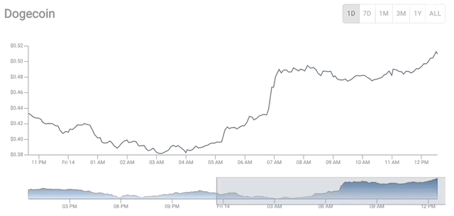

This is a Vite + React and dependencies fixed version of the original project. The original project was created with Create React App and had some dependencies issues. I fixed them and now it works with Vite + React.

Thanks to the original author for the project. The original project can be found [here](https://github.com/ayepRahman/react-crypto-tracker).

For this project, used below technologies,

- reactjs with typescript (Vite + React)
- visx for visualization
- styled-component for styling
- coingecko api
- material-ui for ui components.
- and other libraries.

# Getting Started with Vite + React

This project was bootstrapped with [Vite + React](https://vitejs.dev/guide/).

## Available Scripts

In the project directory, you can run:

### `yarn run dev`

Runs the app in the development mode.\
Open [http://localhost:5173](http://localhost:5173) to view it in the browser.

The page will reload if you make edits.\
You will also see any lint errors in the console.

### `yarn run build`

Builds the app for production to the `dist` folder.\
It correctly bundles React in production mode and optimizes the build for the best performance.

The build is minified and the filenames include the hashes.\
Your app is ready to be deployed!

